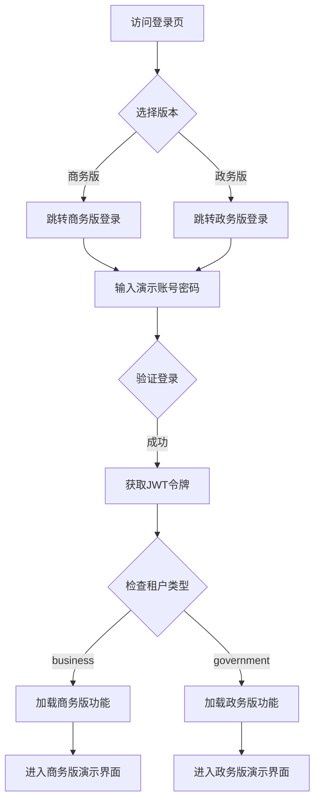

# LuminaMedia 演示版升级计划

## 1. 项目背景

### 1.1 当前状态
- **2.0重构已完成**：四大核心模块（SmartDataEngine、AI Agent、矩阵分发、客户大脑）完整实现
- **架构稳定**：模块化单体架构、多租户隔离、Docker容器化部署
- **功能基础完整**：演示功能已初步实现，支持快速启动演示流程

### 1.2 升级目标
- 将当前的演示功能升级为**可对外测试的稳定演示版**
- 支持**商务版**和**政务版**两种演示场景
- 建立完整的演示数据管理体系
- 实现演示版与正式版的数据隔离和功能区分

---

## 2. 演示版架构设计

### 2.1 环境关系图
```
┌─────────────────────────────────────────────────────┐
│                   正式版生产环境                     │
│  ┌─────────────────┐  ┌─────────────────┐          │
│  │ 商务版租户       │  │ 政务版租户       │          │
│  │ (正式客户数据)   │  │ (正式客户数据)   │          │
│  └─────────────────┘  └─────────────────┘          │
└─────────────────────────────────────────────────────┘
                          │
                          │
┌─────────────────────────┴───────────────────────────┐
│                   演示版环境（子集）                 │
│  ┌─────────────────┐  ┌─────────────────┐          │
│  │ 商务版演示租户   │  │ 政务版演示租户   │          │
│  │ (演示数据隔离)   │  │ (演示数据隔离)   │          │
│  │ 功能完整         │  │ 功能完整         │          │
│  │ AI配额限制       │  │ AI配额限制       │          │
│  └─────────────────┘  └─────────────────┘          │
└─────────────────────────────────────────────────────┘
                          │
                          │
┌─────────────────────────┴───────────────────────────┐
│            开发环境 / 测试环境 / 预发布环境         │
│  (用于开发、测试、预发布验证)                       │
└─────────────────────────────────────────────────────┘
```

### 2.2 核心设计原则

#### 2.2.1 数据隔离策略
- **租户级隔离**：通过`tenant_id`字段实现逻辑隔离
- **专用演示租户**：
  - 商务版演示租户：`demo-business-001`
  - 政务版演示租户：`demo-government-001`
- **数据库共享**：演示版与正式版使用同一数据库，但通过租户隔离

#### 2.2.2 功能完整策略
- 演示版功能完整（包括AI生成、发布等核心功能）
- 通过**配额限制**控制资源消耗：
  - AI调用配额：每日5次真实AI调用
  - 发布次数限制：每日10次发布
  - 数据导入限制：每日3次数据导入

#### 2.2.3 用户管理策略
- **专用演示租户**：所有演示用户归属专用演示租户
- **固定演示账号**：
  - 商务版：`demo@business.com` / 密码：`LuminaDemo2026`
  - 政务版：`demo@government.com` / 密码：`LuminaDemo2026`
- **无需注册**：直接使用演示账号登录

---

## 3. 商务版 vs 政务版设计

### 3.1 入口区分方式
- **租户类型区分**：登录时选择版本，后端根据选择创建不同类型的租户
- **登录页版本选择**：登录页提供两个入口按钮（商务版/政务版）

### 3.2 功能模块差异化

| 功能模块 | 商务版 | 政务版 | 说明 |
|---------|--------|--------|------|
| **核心数据面板** | 客户画像分析 | 舆情监测面板 | 商务版关注销售指标，政务版关注舆情指标 |
| **智能数据魔方** | ✓ | ✗ | 商务版独有（客户数据导入和分析） |
| **AI智策工厂** | ✓ | ✓ | 两者都有，但业务场景不同 |
| **矩阵分发中心** | ✓ | ✓ | 政务版发布渠道不同 |
| **客户大脑** | ✓ | ✗ | 商务版独有（企业画像） |
| **舆情监测** | ✓ | ✓ | 政务版更深入 |
| **GEO分析** | ✗ | ✓ | 政务版独有（地域舆情分析） |
| **政府内容发布** | ✗ | ✓ | 政务版独有（政府公文发布） |

### 3.3 数据类型差异化

#### 商务版
- **关注指标**：销售额、转化率、客户生命周期价值、ROI
- **数据来源**：CRM系统、POS系统、电商平台、社交媒体
- **分析维度**：客户分群、消费行为、营销效果、竞品分析

#### 政务版
- **关注指标**：舆情指数、正面/负面比例、传播范围、响应及时度
- **数据来源**：政务微博、政府网站、新闻媒体、社交媒体
- **分析维度**：舆情情感、热点话题、地域分布、时间趋势

### 3.4 演示数据差异化

#### 商务版演示数据
- **场景**：商场顾客营销方案
- **数据量**：1000条顾客消费记录
- **内容**：
  - 5个客户分群（高价值VIP、年轻时尚族群、家庭消费群体、价值寻求者、数字化原住民）
  - "商场春季焕新购物节"营销活动
  - 4种营销策略（内容策略、渠道策略、时间策略、预算策略）
  - 跨平台营销内容（小红书、微信公众号）

#### 政务版演示数据
- **场景**：政务舆情监测和政策宣传
- **数据量**：5000条舆情数据（模拟）
- **内容**：
  - 政务微博账号（模拟）
  - 政策宣传内容包
  - 舆情热点分析报告
  - 政府公文发布流程

---

## 4. 演示数据管理方案

### 4.1 混合模式设计

#### 预置静态数据（基础展示）
- **目的**：用户登录后立即看到完整的演示数据
- **内容**：
  - 演示租户下的预设企业档案
  - 客户分群分析结果
  - 营销活动和策略
  - 历史营销内容
- **优势**：快速展示，无需等待生成

#### 动态生成数据（交互体验）
- **目的**：用户可执行真实操作，体验完整流程
- **触发方式**：点击"一键演示"按钮
- **内容**：
  - 调用`/api/v1/analytics/demo/quick-start`接口
  - 动态生成新的客户档案、分群、活动、策略、内容
  - 每次执行都是全新数据

#### 数据隔离
- 预置静态数据：`is_demo_data=true`标记
- 动态生成数据：`is_demo_data=false`标记
- 两者独立存储，互不干扰

### 4.2 数据生命周期管理

#### 手动重置
- **重置按钮**：演示界面提供"重置演示"按钮
- **重置范围**：清空当前租户下所有演示数据（包括静态和动态）
- **重置后**：自动重新导入预置静态数据

#### 重置接口
- `DELETE /api/v1/analytics/demo/reset` - 重置演示数据
- 支持参数：`userId`（重置指定用户数据）或重置当前租户全部数据

### 4.3 演示数据持久化策略

#### 策略选择：保留历史数据
- 演示数据会不断累积
- 用户可以看到自己的操作历史
- 便于演示多个场景和流程
- **注意**：通过配额限制控制数据量增长

---

## 5. 配额限制方案

### 5.1 配额配置表

| 资源类型 | 配额限制 | 重置周期 | 说明 |
|---------|---------|---------|------|
| **AI调用次数** | 5次/天 | 每日00:00 | 超出后返回Mock数据 |
| **内容发布次数** | 10次/天 | 每日00:00 | 超出后禁止发布操作 |
| **数据导入次数** | 3次/天 | 每日00:00 | 超出后禁止导入操作 |
| **API调用总量** | 100次/天 | 每日00:00 | 限流保护 |
| **并发请求数** | 5个/租户 | 实时 | 保护系统资源 |

### 5.2 配额实现方式

#### 数据库设计
```sql
CREATE TABLE tenant_quotas (
    tenant_id CHAR(36) PRIMARY KEY,
    ai_calls_limit INT DEFAULT 5,
    ai_calls_used INT DEFAULT 0,
    publish_limit INT DEFAULT 10,
    publish_used INT DEFAULT 0,
    import_limit INT DEFAULT 3,
    import_used INT DEFAULT 0,
    api_calls_limit INT DEFAULT 100,
    api_calls_used INT DEFAULT 0,
    reset_time TIMESTAMP DEFAULT CURRENT_TIMESTAMP,
    updated_at TIMESTAMP DEFAULT CURRENT_TIMESTAMP ON UPDATE CURRENT_TIMESTAMP,
    FOREIGN KEY (tenant_id) REFERENCES tenants(id)
);
```

#### 配额检查中间件
- **位置**：`src/shared/middleware/quota-check.middleware.ts`
- **逻辑**：
  1. 拦截所有API请求
  2. 检查当前租户配额使用情况
  3. 判断是否超出限制
  4. 超出限制时返回`429 Too Many Requests`
  5. 未超出限制时记录使用量

#### 配额重置定时任务
- **位置**：`src/shared/tasks/quota-reset.task.ts`
- **执行时间**：每日00:00 UTC+8
- **逻辑**：
  1. 扫描所有演示租户
  2. 重置配额使用量为0
  3. 更新重置时间

---

## 6. 用户管理方案

### 6.1 演示账号配置

#### 商务版演示账号
- **用户名**：`demo@business.com`
- **密码**：`LuminaDemo2026`
- **租户**：`demo-business-001`
- **角色**：演示管理员

#### 政务版演示账号
- **用户名**：`demo@government.com`
- **密码**：`LuminaDemo2026`
- **租户**：`demo-government-001`
- **角色**：演示管理员

### 6.2 登录流程



### 6.3 租户类型字段

#### 数据库修改
```sql
-- 为tenants表添加type字段
ALTER TABLE tenants 
ADD COLUMN type ENUM('business', 'government', 'demo_business', 'demo_government', 'development') 
DEFAULT 'business' COMMENT '租户类型';

-- 为演示租户设置类型
UPDATE tenants 
SET type = 'demo_business' 
WHERE id = 'demo-business-001';

UPDATE tenants 
SET type = 'demo_government' 
WHERE id = 'demo-government-001';
```

#### 后端实现
- **位置**：`src/entities/tenant.entity.ts`
- **新增字段**：
  ```typescript
  export enum TenantType {
    BUSINESS = 'business',
    GOVERNMENT = 'government',
    DEMO_BUSINESS = 'demo_business',
    DEMO_GOVERNMENT = 'demo_government',
    DEVELOPMENT = 'development',
  }

  @Column({
    type: 'enum',
    enum: TenantType,
    default: TenantType.BUSINESS,
  })
  type: TenantType;
  ```

---

## 7. AI服务策略

### 7.1 真实AI+配额限制

#### 实现逻辑
1. **配额检查**：调用AI服务前先检查配额
2. **真实调用**：配额未用尽时调用真实Gemini/Qwen API
3. **Mock降级**：配额用尽后返回预定义的Mock响应
4. **友好提示**：在界面显示配额使用情况和重置时间

#### Mock降级示例
```typescript
async generateContent(prompt: string): Promise<string> {
  const tenantId = this.tenantContextService.getCurrentTenantId();
  
  // 检查配额
  const quota = await this.quotaService.checkAiQuota(tenantId);
  if (!quota.canUse) {
    // 配额用尽，返回Mock数据
    return this.getMockContent(prompt);
  }
  
  // 配额充足，调用真实AI
  try {
    const result = await this.geminiService.generate(prompt);
    await this.quotaService.consumeAiQuota(tenantId);
    return result;
  } catch (error) {
    // AI服务异常，降级为Mock
    return this.getMockContent(prompt);
  }
}
```

### 7.2 Mock数据生成策略

#### 预定义模板
- **营销文案模板**：10套预定义文案模板
- **分析报告模板**：5套预定义分析报告
- **策略建议模板**：8套预定义策略建议

#### 动态替换
- 使用占位符替换（如`{企业名称}`、`{产品名}`、`{行业}`）
- 根据上下文动态生成个性化内容

---

## 8. 界面设计

### 8.1 登录页设计

#### 版本选择入口
```
┌─────────────────────────────────────┐
│      LuminaMedia 演示平台            │
├─────────────────────────────────────┤
│                                     │
│   ┌──────────────┐  ┌──────────────┐│
│   │  商务版演示   │  │  政务版演示   ││
│   │              │  │              ││
│   │  客户画像     │  │  舆情监测     ││
│   │  营销分析     │  │  政策宣传     ││
│   │  智能投放     │  │  政务发布     ││
│   └──────────────┘  └──────────────┘│
│                                     │
│  账号: demo@business.com / demo@government.com│
│  密码: LuminaDemo2026               │
└─────────────────────────────────────┘
```

### 8.2 演示版特色标识

#### 顶部横幅
- **颜色**：蓝色横幅
- **文字**："当前为演示环境，数据为演示数据，功能完整但配额受限"
- **配额显示**："AI调用：2/5次 | 发布次数：3/10次"

#### 重置按钮
- **位置**：右上角操作栏
- **图标**：🔄 重置演示
- **提示**："点击重置所有演示数据"

---

## 9. 实施计划

### 9.1 阶段一：基础架构搭建（预计1-2天）

#### 任务清单
- [ ] 创建演示租户（`demo-business-001`、`demo-government-001`）
- [ ] 创建演示账号并设置密码
- [ ] 为tenants表添加`type`字段
- [ ] 配置演示租户的配额限制

#### 数据库脚本
```sql
-- 创建演示租户
INSERT INTO tenants (id, name, type, status) VALUES
('demo-business-001', '商务版演示租户', 'demo_business', 'active'),
('demo-government-001', '政务版演示租户', 'demo_government', 'active');

-- 创建演示账号
INSERT INTO users (id, username, password_hash, email, tenant_id) VALUES
(UUID(), 'demo@business.com', '$2b$hashed_password', 'demo@business.com', 'demo-business-001'),
(UUID(), 'demo@government.com', '$2b$hashed_password', 'demo@government.com', 'demo-government-001');

-- 创建配额配置
INSERT INTO tenant_quotas (tenant_id, ai_calls_limit, publish_limit, import_limit, api_calls_limit) VALUES
('demo-business-001', 5, 10, 3, 100),
('demo-government-001', 5, 10, 3, 100);
```

### 9.2 阶段二：功能差异化实现（预计2-3天）

#### 任务清单
- [ ] 创建`TenantType`枚举类型
- [ ] 修改登录逻辑，支持根据租户类型加载不同功能
- [ ] 实现商务版功能开关
- [ ] 实现政务版功能开关
- [ ] 创建功能配置表

#### 后端代码修改
```typescript
// src/shared/services/tenant-context.service.ts
export class TenantContextService {
  getTenantType(): TenantType {
    const tenant = this.getCurrentTenant();
    return tenant.type;
  }
  
  isBusinessTenant(): boolean {
    return this.getTenantType() === TenantType.BUSINESS || 
           this.getTenantType() === TenantType.DEMO_BUSINESS;
  }
  
  isGovernmentTenant(): boolean {
    return this.getTenantType() === TenantType.GOVERNMENT || 
           this.getTenantType() === TenantType.DEMO_GOVERNMENT;
  }
}

// 功能开关中间件
@Injectable()
export class FeatureToggleGuard implements CanActivate {
  canActivate(context: ExecutionContext): boolean {
    const tenantType = this.tenantContextService.getTenantType();
    const requiredType = context.getHandler().getRequiredTenantType();
    
    if (requiredType === 'business' && !this.tenantContextService.isBusinessTenant()) {
      throw new ForbiddenException('此功能仅在商务版可用');
    }
    
    if (requiredType === 'government' && !this.tenantContextService.isGovernmentTenant()) {
      throw new ForbiddenException('此功能仅在政务版可用');
    }
    
    return true;
  }
}
```

### 9.3 阶段三：配额限制实现（预计2天）

#### 任务清单
- [ ] 创建`tenant_quotas`表
- [ ] 实现配额检查中间件
- [ ] 实现配额消耗逻辑
- [ ] 实现配额重置定时任务
- [ ] 前端配额显示组件

### 9.4 阶段四：演示数据管理（预计2天）

#### 任务清单
- [ ] 准备商务版预置静态数据
- [ ] 准备政务版预置静态数据
- [ ] 实现演示数据初始化脚本
- [ ] 实现演示数据重置接口
- [ ] 实现动态生成数据逻辑

### 9.5 阶段五：AI降级策略（预计1-2天）

#### 任务清单
- [ ] 实现配额检查逻辑
- [ ] 准备Mock数据模板
- [ ] 实现Mock降级逻辑
- [ ] 实现配额用尽提示

### 9.6 阶段六：前端适配（预计2-3天）

#### 任务清单
- [ ] 修改登录页，增加版本选择入口
- [ ] 实现版本切换逻辑
- [ ] 添加演示环境标识
- [ ] 添加配额显示组件
- [ ] 添加重置演示按钮
- [ ] 根据租户类型动态加载功能菜单

### 9.7 阶段七：测试和部署（预计1-2天）

#### 任务清单
- [ ] 功能测试（商务版+政务版）
- [ ] 配额限制测试
- [ ] 演示数据管理测试
- [ ] 部署到演示环境
- [ ] 文档编写

---

## 10. 风险评估与应对

### 10.1 技术风险

| 风险项 | 影响程度 | 应对策略 |
|-------|---------|---------|
| 配额系统性能问题 | 中 | 使用Redis缓存配额数据，定时同步到数据库 |
| 多租户数据隔离失效 | 高 | 严格测试租户隔离逻辑，增加数据访问日志 |
| Mock数据质量不足 | 低 | 准备丰富的模板，定期更新 |

### 10.2 运营风险

| 风险项 | 影响程度 | 应对策略 |
|-------|---------|---------|
| 演示账号被滥用 | 中 | 设置强密码，定期更换，监控异常登录 |
| 配额被恶意刷取 | 中 | 增加IP限流，异常行为检测 |
| 演示数据被误操作删除 | 低 | 定期备份演示数据，提供快速恢复机制 |

---

## 11. 后续优化方向

### 11.1 短期优化（1个月内）
- 增加演示数据统计分析功能
- 优化配额重置策略（支持自定义重置时间）
- 增加演示版使用情况监控

### 11.2 中期优化（3个月内）
- 实现演示版自动化测试脚本
- 增加多语言支持（中英文切换）
- 优化演示数据生成算法

### 11.3 长期优化（6个月内）
- 实现演示版A/B测试功能
- 增加演示版用户反馈收集机制
- 优化演示版性能和用户体验

---

## 12. 总结

### 12.1 核心设计要点
1. **租户级隔离**：通过`tenant_id`实现数据隔离，简单高效
2. **功能完整+配额限制**：保证体验完整性，控制资源消耗
3. **混合数据模式**：预置静态数据 + 动态生成数据
4. **手动重置**：用户可控的数据生命周期管理
5. **真实AI+降级**：真实调用 + 配额用尽后Mock降级

### 12.2 预期效果
- ✅ **商务版和政务版**功能差异化清晰
- ✅ **演示数据**丰富且易于管理
- ✅ **配额系统**有效控制资源消耗
- ✅ **用户体验**完整且流畅
- ✅ **运维成本**可控（共享数据库）

### 12.3 下一步行动
1. 确认本方案的设计细节
2. 开始实施阶段一（基础架构搭建）
3. 同步进行前端登录页设计
4. 准备演示数据模板

---

**文档版本**: v1.0  
**创建日期**: 2026-04-03  
**作者**: LuminaMedia AI Team  
**审核状态**: 待审核
